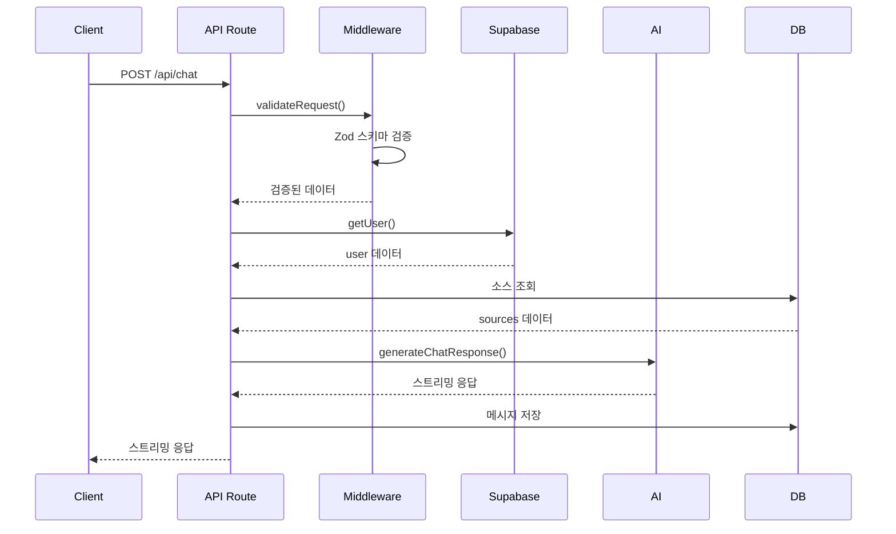
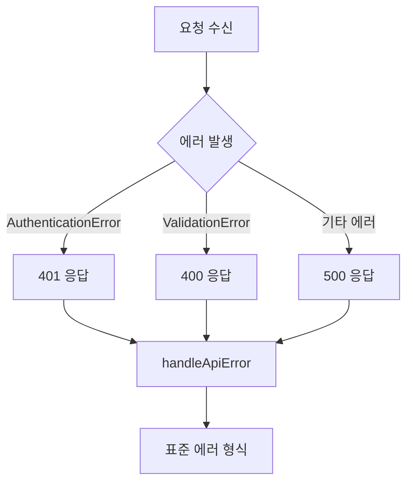

# 데이터 흐름 (Data Flow)

## 요청 수명 주기

### 1. API 요청 처리



### 2. 페이지 렌더링

```mermaid
flowchart TD
    A[클라이언트 요청] --> B{인증 여부?}
    B -->|미인증| C[/login 리다이렉트]
    B -->|인증됨| D[서버 컴포넌트 렌더링]
    D --> E[데이터 패칭]
    E --> F[클라이언트 컴포넌트 하이드레이션]
    F --> G[TanStack Query 캐시 확인]
    G -->|캐시 있음| H[캐시된 데이터 사용]
    G -->|캐시 없음| I[API 요청]
    I --> J[서버 상태 업데이트]
    J --> K[UI 재렌더링]
```

## 상태 관리

### 서버 상태 (TanStack Query)
```typescript
// 패칱
const { data } = useQuery({
  queryKey: ['notebooks'],
  queryFn: () => fetchNotebooks()
})

// 무효화
queryClient.invalidateQueries({ queryKey: ['notebooks'] })
```

### 클라이언트 상태 (Zustand)
```typescript
// 로컬 상태
const store = create((set) => ({
  isOpen: false,
  toggle: () => set((state) => ({ isOpen: !state.isOpen }))
}))
```

### 폼 상태 (React Hook Form)
```typescript
// 폼 데이터
const { register, handleSubmit } = useForm({
  resolver: zodResolver(schema)
})
```

## 데이터 저장소

### Supabase 테이블 (추정)
- **auth.users**: 사용자 인증 (Supabase Auth)
- **chat_messages**: 채팅 메시지
- **notebooks**: 노트북
- **sources**: 소스 파일
- **public.profiles**: 사용자 프로필

## 인증 흐름

```mermaid
flowchart LR
    A[사용자] --> B[/login]
    B --> C[Supabase Auth]
    C --> D{인증 성공?}
    D -->|아니오| E[에러 표시]
    D -->|예| F[/auth/callback]
    F --> G[세션 설정]
    G --> H[/home 리다이렉트]
```

## 에러 처리 흐름



## 스트리밍 응답 처리

### AI 채팅 스트리밍
1. 클라이언트가 POST /api/chat 요청
2. 서버가 Gemini API 호출
3. 스트리밍 응답을 TransformStream으로 파이프
4. 청크를 실시간으로 클라이언트에 전송
5. 스트림 완료 시 전체 내용을 DB에 저장

## 캐싱 전략

### TanStack Query 캐시
- **기본 TTL**: 5분
- **staleTime**: 0분 (항상 refetch)
- **gcTime**: 5분 (캐시 보존)

### Next.js 캐시
- **정적 페이지**: 빌드 시 생성
- **동적 페이지**: 요청 시 렌더링
- **API 응답**: no-store (항상 최신 데이터)
